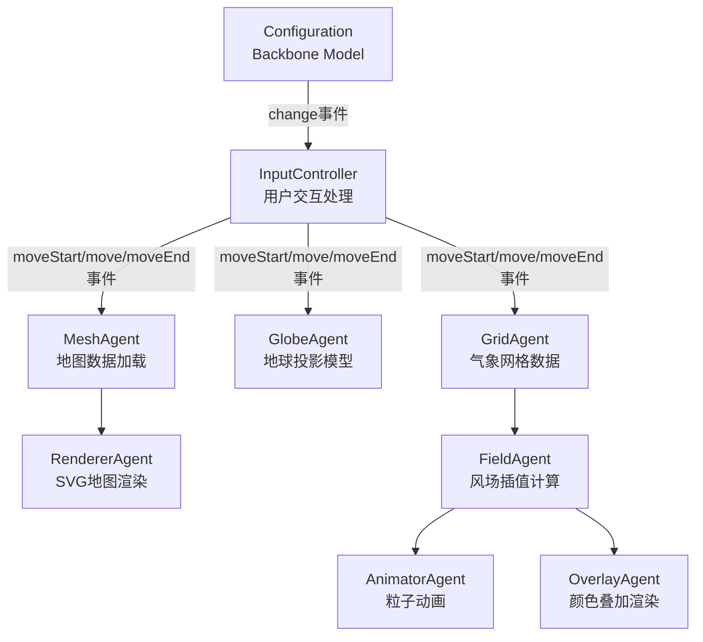

# Earth项目技术分析报告

## 目录
- [项目概述](#项目概述)
- [核心功能](#核心功能)
- [技术架构](#技术架构)
- [数据来源与格式](#数据来源与格式)
- [数据获取方法](#数据获取方法)
- [本地运行指南](#本地运行指南)
- [核心技术实现亮点](#核心技术实现亮点)
- [项目结构说明](#项目结构说明)
- [技术总结](#技术总结)

## 项目概述

Earth是一个全球天气状况可视化项目，由Cameron Beccario开发。该项目基于早期的[Tokyo Wind Map](https://github.com/cambecc/air)项目，是一个个人学习项目，用于掌握JavaScript和浏览器编程技术。

**项目特点：**
- 实时可视化全球风场和天气数据
- 支持多种地图投影和交互操作
- 基于超级计算机预报数据
- 每3小时更新一次气象数据
- 每5天更新一次海洋洋流数据

**在线演示：** http://earth.nullschool.net

## 核心功能

### 1. 风场动画可视化
- 使用粒子动画技术展示全球风向和风速
- 支持不同气压层的气象数据可视化
- 实时粒子流动效果，直观展示风场变化

### 2. 多层气象数据支持
支持8个不同气压层的数据：
- **地表层** (Surface)
- **1000 hPa** (~100m高度，近海平面条件)
- **850 hPa** (~1500m高度)
- **700 hPa** (~3000m高度)
- **500 hPa** (~5500m高度)
- **250 hPa** (~10000m高度)
- **70 hPa** (~18000m高度)
- **10 hPa** (~30000m高度)

### 3. 多种叠加图层
- **风速** (Wind Speed)
- **温度** (Temperature)
- **相对湿度** (Relative Humidity)
- **空气密度** (Air Density)
- **风能密度** (Wind Power Density)
- **可降水量** (Total Precipitable Water)
- **总云水** (Total Cloud Water)
- **海平面气压** (Mean Sea Level Pressure)

### 4. 海洋洋流数据
- 显示全球海洋表面洋流
- 基于OSCAR (Ocean Surface Current Analysis Real-time)数据
- 每5天更新一次

### 5. 多种地图投影
支持8种不同的地图投影方式：
- **正交投影** (Orthographic)
- **立体投影** (Stereographic)
- **等距圆锥投影** (Conic Equidistant)
- **等距方位投影** (Azimuthal Equidistant)
- **等距圆柱投影** (Equirectangular)
- **Winkel Tripel投影**
- **Waterman Butterfly投影**
- **Atlantis投影**

### 6. 交互功能
- **拖拽旋转**：鼠标拖拽旋转地球
- **缩放控制**：滚轮或手势缩放
- **点击查询**：点击查看具体位置的气象数据
- **时间控制**：前进/后退查看不同时间的数据
- **位置定位**：自动定位到用户当前位置

## 技术架构

### 前端技术栈

| 技术 | 版本 | 用途 |
|------|------|------|
| **D3.js** | 3.3.10 | 地图投影、SVG渲染、数据可视化 |
| **Backbone.js** | 1.1.0 | MVC架构、状态管理、URL路由 |
| **Underscore.js** | 1.6.0 | 工具函数库 |
| **TopoJSON** | 1.1.0 | 地理数据格式，压缩地图数据 |
| **when.js** | 2.6.0 | Promise库，处理异步操作 |
| **HTML5 Canvas** | - | 粒子动画和颜色叠加渲染 |
| **SVG** | - | 地图渲染 |

### 后端技术栈

| 技术 | 版本 | 用途 |
|------|------|------|
| **Node.js** | >= 0.10.21 | 运行环境 |
| **Express** | 3.4.4 | 静态文件服务器 |
| **Swig** | 1.2.2 | 模板引擎 |

### 架构设计

项目采用**事件驱动架构**，核心组件通过事件进行通信：



### 核心JavaScript模块

#### 1. micro.js - 工具函数集合
```javascript
// 核心工具函数
var µ = function() {
    "use strict";
    
    // 数学工具
    function distance(a, b) { /* 计算两点距离 */ }
    function clamp(x, low, high) { /* 数值范围限制 */ }
    function floorMod(a, n) { /* 取模运算 */ }
    
    // 颜色处理
    function extendedSinebowColor(v, a) { /* 颜色渐变 */ }
    
    // 设备检测
    function isMobile() { /* 移动设备检测 */ }
    
    return {
        distance: distance,
        clamp: clamp,
        // ... 其他工具函数
    };
}();
```

#### 2. globes.js - 地球投影模型
```javascript
var globes = function() {
    "use strict";
    
    // 标准地球模型
    function standardGlobe() {
        return {
            projection: null,
            newProjection: function(view) { /* 创建新投影 */ },
            bounds: function(view) { /* 计算投影边界 */ },
            fit: function(view) { /* 自适应缩放 */ },
            center: function(view) { /* 居中显示 */ },
            scaleExtent: function() { /* 缩放范围 */ },
            orientation: function(o, view) { /* 方向控制 */ }
        };
    }
    
    // 不同投影类型
    return {
        orthographic: function() { /* 正交投影 */ },
        stereographic: function() { /* 立体投影 */ },
        // ... 其他投影
    };
}();
```

#### 3. products.js - 气象数据产品定义
```javascript
var products = function() {
    "use strict";
    
    // 风场数据产品
    "wind": {
        matches: _.matches({param: "wind"}),
        create: function(attr) {
            return buildProduct({
                field: "vector",
                type: "wind",
                paths: [gfs1p0degPath(attr, "wind", attr.surface, attr.level)],
                date: gfsDate(attr),
                builder: function(file) {
                    var uData = file[0].data, vData = file[1].data;
                    return {
                        header: file[0].header,
                        interpolate: bilinearInterpolateVector,
                        data: function(i) { return [uData[i], vData[i]]; }
                    }
                },
                units: [
                    {label: "km/h", conversion: function(x) { return x * 3.6; }},
                    {label: "m/s", conversion: function(x) { return x; }},
                    {label: "kn", conversion: function(x) { return x * 1.943844; }},
                    {label: "mph", conversion: function(x) { return x * 2.236936; }}
                ]
            });
        }
    }
};
```

#### 4. earth.js - 主应用逻辑
```javascript
// 核心组件初始化
var configuration = µ.buildConfiguration(globes, products.overlayTypes);
var inputController = buildInputController();
var meshAgent = newAgent();
var globeAgent = newAgent();
var gridAgent = newAgent();
var rendererAgent = newAgent();
var fieldAgent = newAgent();
var animatorAgent = newAgent();
var overlayAgent = newAgent();

// 事件绑定和组件协调
configuration.on("change", function() { /* 配置变化处理 */ });
inputController.on("moveStart", function() { /* 开始移动 */ });
inputController.on("move", function() { /* 移动中 */ });
inputController.on("moveEnd", function() { /* 移动结束 */ });
```

## 数据来源与格式

### 气象数据（Weather Data）

#### 数据来源
- **系统**：GFS (Global Forecast System)
- **提供方**：美国国家气象局 NCEP (National Centers for Environmental Prediction)
- **官网**：http://www.emc.ncep.noaa.gov
- **下载地址**：http://nomads.ncep.noaa.gov

#### 数据特性
- **更新频率**：每3小时更新一次
- **分辨率**：1° × 1° 网格（360×181个数据点）
- **覆盖范围**：全球
- **原始格式**：GRIB2格式
- **使用格式**：JSON格式

#### 数据结构
```json
[{
  "header": {
    "discipline": 0,
    "disciplineName": "Meteorological products",
    "gribEdition": 2,
    "center": 7,
    "centerName": "US National Weather Service - NCEP(WMC)",
    "refTime": "2014-01-31T00:00:00.000Z",
    "significanceOfRT": 1,
    "significanceOfRTName": "Start of forecast",
    "parameterNumberName": "U-component_of_wind",
    "parameterUnit": "m.s-1",
    "forecastTime": 3,
    "surface1TypeName": "Specified height level above ground",
    "surface1Value": 10,
    "nx": 360,
    "ny": 181,
    "lo1": 0,
    "la1": 90,
    "lo2": 359,
    "la2": -90,
    "dx": 1,
    "dy": 1
  },
  "data": [-4.76, -4.75, -4.73, -4.72, -4.7, ...]
}]
```

**风速数据包含两个分量：**
- **U分量**：东西向风速（m/s）
- **V分量**：南北向风速（m/s）

### 海洋洋流数据（Ocean Currents）

#### 数据来源
- **系统**：OSCAR (Ocean Surface Current Analysis Real-time)
- **提供方**：Earth & Space Research
- **官网**：http://www.esr.org/oscar_index.html

#### 数据特性
- **更新频率**：每5天更新一次
- **分辨率**：0.33°网格
- **文件位置**：`/public/data/oscar/`

#### 目录结构
```json
["20140131-surface-currents-oscar-0.33.json"]
```

### 地图数据（Geographic Data）

#### 数据来源
- **系统**：Natural Earth
- **官网**：http://www.naturalearthdata.com
- **格式**：TopoJSON（从Shapefile转换）

#### 数据内容
- **海岸线数据**：不同精度的海岸线
- **湖泊数据**：主要湖泊和内陆水域
- **两个版本**：
  - `earth-topo.json`：桌面版（更详细）
  - `earth-topo-mobile.json`：移动版（简化）

## 数据获取方法

### 1. 气象数据获取

#### 环境准备
```bash
# 安装grib2json工具
git clone https://github.com/cambecc/grib2json
cd grib2json
make
sudo make install
```

#### 下载和转换
```bash
# 设置日期（格式：YYYYMMDD）
YYYYMMDD=20140101

# 下载GFS数据（10m高度的风场u和v分量）
curl "http://nomads.ncep.noaa.gov/cgi-bin/filter_gfs.pl?file=gfs.t00z.pgrb2.1p00.f000&lev_10_m_above_ground=on&var_UGRD=on&var_VGRD=on&dir=%2Fgfs.${YYYYMMDD}00" -o gfs.t00z.pgrb2.1p00.f000

# 转换为JSON格式
grib2json -d -n -o current-wind-surface-level-gfs-1.0.json gfs.t00z.pgrb2.1p00.f000

# 复制到项目目录
cp current-wind-surface-level-gfs-1.0.json public/data/weather/current/
```

#### 不同气压层数据
```bash
# 1000 hPa层
curl "http://nomads.ncep.noaa.gov/cgi-bin/filter_gfs.pl?file=gfs.t00z.pgrb2.1p00.f000&lev_1000_mb=on&var_UGRD=on&var_VGRD=on&dir=%2Fgfs.${YYYYMMDD}00" -o gfs_1000hPa.grib2

# 500 hPa层
curl "http://nomads.ncep.noaa.gov/cgi-bin/filter_gfs.pl?file=gfs.t00z.pgrb2.1p00.f000&lev_500_mb=on&var_UGRD=on&var_VGRD=on&dir=%2Fgfs.${YYYYMMDD}00" -o gfs_500hPa.grib2
```

### 2. 地图数据获取

#### 环境准备
```bash
# 安装GDAL
# Ubuntu/Debian
sudo apt-get install gdal-bin

# macOS
brew install gdal

# 安装topojson
npm install -g topojson
```

#### 下载和转换
```bash
# 下载Natural Earth数据
curl "http://www.nacis.org/naturalearth/50m/physical/ne_50m_coastline.zip" -o ne_50m_coastline.zip
curl "http://www.nacis.org/naturalearth/50m/physical/ne_50m_lakes.zip" -o ne_50m_lakes.zip
curl "http://www.nacis.org/naturalearth/110m/physical/ne_110m_coastline.zip" -o ne_110m_coastline.zip
curl "http://www.nacis.org/naturalearth/110m/physical/ne_110m_lakes.zip" -o ne_110m_lakes.zip

# 解压
unzip -o ne_*.zip

# 转换为GeoJSON
ogr2ogr -f GeoJSON coastline_50m.json ne_50m_coastline.shp
ogr2ogr -f GeoJSON coastline_110m.json ne_110m_coastline.shp
ogr2ogr -f GeoJSON -where "scalerank < 4" lakes_50m.json ne_50m_lakes.shp
ogr2ogr -f GeoJSON -where "scalerank < 2 AND admin='admin-0'" lakes_110m.json ne_110m_lakes.shp

# 创建简化版本（移动端）
ogr2ogr -f GeoJSON -simplify 1 coastline_tiny.json ne_110m_coastline.shp
ogr2ogr -f GeoJSON -simplify 1 -where "scalerank < 2 AND admin='admin-0'" lakes_tiny.json ne_110m_lakes.shp

# 转换为TopoJSON
topojson -o earth-topo.json coastline_50m.json coastline_110m.json lakes_50m.json lakes_110m.json
topojson -o earth-topo-mobile.json coastline_110m.json coastline_tiny.json lakes_110m.json lakes_tiny.json

# 复制到项目目录
cp earth-topo*.json public/data/
```

### 3. 字体子集化

#### M+ FONTS子集化
```bash
# 查找使用的字符
node find-chars.js

# 使用M+Web FONTS Subsetter
# 访问：http://mplus.font-face.jp/
# 上传字体文件，选择需要的字符，下载子集字体
# 保存到：public/styles/
```

#### Mono Social Icons Font子集化
```bash
# 使用Font Squirrel's WebFont Generator
# 访问：http://www.fontsquirrel.com/tools/webfont-generator
# 上传字体文件，生成子集字体
# 保存到：public/styles/
```

## 本地运行指南

### 环境要求
- **Node.js**：>= 0.10.21
- **npm**：包管理器
- **现代浏览器**：支持HTML5 Canvas和SVG

### 安装步骤

#### 1. 克隆项目
```bash
git clone https://github.com/cambecc/earth
cd earth
```

#### 2. 安装依赖
```bash
npm install
```

#### 3. 启动开发服务器
```bash
# 启动服务器（端口8080）
node dev-server.js 8080

# 或者指定其他端口
node dev-server.js 3000
```

#### 4. 访问应用
打开浏览器访问：`http://localhost:8080`

### 注意事项

#### Ubuntu/Mint/elementary OS
由于命名冲突，需要使用`nodejs`命令：
```bash
nodejs dev-server.js 8080
```

#### 数据文件
项目已包含示例数据文件：
- `public/data/weather/current/current-wind-surface-level-gfs-1.0.json`
- `public/data/earth-topo.json`
- `public/data/earth-topo-mobile.json`

#### 服务器特性
- 纯静态文件服务器
- 支持GZIP压缩
- 缓存控制（5分钟）
- 详细访问日志

## 核心技术实现亮点

### 1. 双线性插值算法
```javascript
function bilinearInterpolateVector(x, y, g00, g10, g01, g11) {
    var rx = (1 - x);
    var ry = (1 - y);
    var a = rx * ry, b = x * ry, c = rx * y, d = x * y;
    var u = g00[0] * a + g10[0] * b + g01[0] * c + g11[0] * d;
    var v = g00[1] * a + g10[1] * b + g01[1] * c + g11[1] * d;
    return [u, v];
}
```

**优势：**
- 1°分辨率数据通过插值实现平滑过渡
- 计算效率高，适合实时渲染
- 保持数据精度

### 2. 投影变形补偿
```javascript
// 使用有限差分近似计算投影变形
function finiteDifferenceApproximation(projection, λ, φ, δ) {
    var λ0 = λ - δ, λ1 = λ + δ;
    var φ0 = φ - δ, φ1 = φ + δ;
    var p0 = projection([λ0, φ]);
    var p1 = projection([λ1, φ]);
    var p2 = projection([λ, φ0]);
    var p3 = projection([λ, φ1]);
    
    return {
        scaleX: (p1[0] - p0[0]) / (2 * δ),
        scaleY: (p3[1] - p2[1]) / (2 * δ)
    };
}
```

**解决的问题：**
- 不同投影方式的地球变形
- 确保粒子路径在投影后正确显示
- 处理极地和高纬度地区的特殊变形

### 3. Canvas蒙版技术
```javascript
// 创建离屏Canvas作为蒙版
function createGlobeMask(projection, width, height) {
    var canvas = document.createElement('canvas');
    canvas.width = width;
    canvas.height = height;
    var ctx = canvas.getContext('2d');
    
    // 绘制地球轮廓
    var path = d3.geo.path().projection(projection).context(ctx);
    ctx.fillStyle = 'white';
    ctx.fill();
    path({type: "Sphere"});
    
    return canvas;
}

// 使用蒙版判断点是否在地球内
function isPointInGlobe(x, y, maskCanvas) {
    var ctx = maskCanvas.getContext('2d');
    var imageData = ctx.getImageData(x, y, 1, 1);
    return imageData.data[3] > 0; // 检查alpha通道
}
```

**技术优势：**
- 精确判断粒子是否在地球范围内
- 支持任意复杂的地球投影
- 性能优化，避免复杂的几何计算

### 4. 粒子动画系统
```javascript
function ParticleAnimator(particles, field, bounds) {
    this.particles = particles;
    this.field = field;
    this.bounds = bounds;
    
    this.animate = function() {
        for (var i = 0; i < this.particles.length; i++) {
            var particle = this.particles[i];
            
            // 更新粒子位置
            var velocity = this.field.interpolate(particle.x, particle.y);
            particle.x += velocity[0] * this.velocityScale;
            particle.y += velocity[1] * this.velocityScale;
            
            // 检查边界
            if (!this.bounds.contains(particle.x, particle.y)) {
                this.respawn(particle);
            }
            
            // 更新年龄
            particle.age++;
            if (particle.age > this.maxAge) {
                this.respawn(particle);
            }
        }
    };
}
```

**特性：**
- 数千个粒子同时动画
- 自适应粒子密度（移动端减少）
- 平滑的粒子生命周期管理
- 基于风场数据的真实物理模拟

### 5. URL状态管理
```javascript
// 使用Backbone Model管理状态
var Configuration = Backbone.Model.extend({
    defaults: {
        orientation: [0, 0, 1],
        projection: "orthographic",
        layer: "wind",
        surface: "surface",
        level: "level"
    },
    
    initialize: function() {
        this.loadFromHash();
        this.on('change', this.saveToHash);
        window.addEventListener('hashchange', this.loadFromHash.bind(this));
    },
    
    saveToHash: function() {
        var hash = this.toJSON();
        window.location.hash = '#' + JSON.stringify(hash);
    },
    
    loadFromHash: function() {
        var hash = window.location.hash.slice(1);
        if (hash) {
            try {
                this.set(JSON.parse(hash));
            } catch (e) {
                console.warn('Invalid hash format');
            }
        }
    }
});
```

**优势：**
- 支持深度链接和书签
- 浏览器前进/后退支持
- 状态持久化
- 无需服务器端状态管理

### 6. 响应式设计
```javascript
// 移动设备检测
function isMobile() {
    return /Android|webOS|iPhone|iPad|iPod|BlackBerry|IEMobile|Opera Mini/i.test(navigator.userAgent);
}

// 自适应粒子数量
var PARTICLE_MULTIPLIER = isMobile() ? 7 * 0.75 : 7;

// 自适应地图数据
var TOPOLOGY = isMobile() ? 
    "/data/earth-topo-mobile.json?v2" : 
    "/data/earth-topo.json?v2";
```

**优化策略：**
- 移动端减少粒子数量
- 使用简化的地图数据
- 优化触摸交互
- 降低动画帧率

## 项目结构说明

```
earth/
├── public/                          # 静态资源目录
│   ├── data/                       # 数据文件目录
│   │   ├── earth-topo.json         # 桌面版地图数据
│   │   ├── earth-topo-mobile.json  # 移动版地图数据
│   │   ├── weather/                # 气象数据目录
│   │   │   └── current/            # 当前气象数据
│   │   │       └── current-wind-surface-level-gfs-1.0.json
│   │   └── oscar/                  # 海洋洋流数据
│   │       ├── catalog.json        # 数据目录
│   │       └── 20140131-surface-currents-oscar-0.33.json
│   ├── libs/                       # 第三方库目录
│   │   ├── d3/3.3.10/             # D3.js库
│   │   ├── backbone.js/1.1.0/     # Backbone.js库
│   │   ├── underscore.js/1.6.0/   # Underscore.js库
│   │   ├── topojson/1.1.0/        # TopoJSON库
│   │   ├── when/2.6.0/            # when.js库
│   │   ├── d3.geo/0.0.0/          # D3地理投影库
│   │   └── earth/1.0.0/           # 项目核心模块
│   │       ├── micro.js           # 工具函数
│   │       ├── globes.js          # 地球投影模型
│   │       ├── products.js        # 数据产品定义
│   │       └── earth.js           # 主应用逻辑
│   ├── styles/                     # 样式文件
│   │   ├── styles.css             # 主样式表
│   │   ├── mplus-2p-light-sub.ttf # M+字体子集
│   │   └── monosocialiconsfont-sub.ttf # 图标字体子集
│   ├── templates/                  # 模板文件
│   │   ├── index.html             # 主页面模板
│   │   ├── about.html             # 关于页面模板
│   │   └── il8n.json              # 国际化文件
│   ├── test/                       # 测试文件
│   │   ├── micro-test.html        # 工具函数测试
│   │   └── products-test.html     # 数据产品测试
│   ├── jp/                         # 日语版本
│   │   ├── index.html
│   │   └── about.html
│   ├── index.html                  # 主页面
│   ├── about.html                  # 关于页面
│   └── favicon.ico                 # 网站图标
├── dev-server.js                   # 开发服务器
├── package.json                    # 项目配置
├── Gruntfile.js                    # 构建配置
├── README.md                       # 项目说明
└── LICENSE.md                      # 许可证
```

### 核心文件说明

#### 1. dev-server.js
```javascript
// 简单的Express静态文件服务器
var express = require("express");
var app = express();

app.use(cacheControl());           // 缓存控制
app.use(express.compress());       // GZIP压缩
app.use(logger());                // 访问日志
app.use(express.static("public")); // 静态文件服务

app.listen(port);
```

#### 2. package.json
```json
{
    "name": "earth",
    "version": "0.0.1",
    "dependencies": {
        "when": "2.6.0",      // Promise库
        "swig": "1.2.2",      // 模板引擎
        "mkdirp": "0.3.5",    // 目录创建
        "express": "3.4.4"    // Web框架
    },
    "devDependencies": {
        "grunt": "~0.4.1",
        "grunt-contrib-jshint": "~0.7.1"
    }
}
```

#### 3. Gruntfile.js
```javascript
// 代码质量检查配置
grunt.initConfig({
    jshint: {
        files: ["*.js", "public/libs/earth/**/*.js"],
        options: {
            globals: {
                Buffer: false,
                console: false,
                // ... 其他全局变量
            }
        }
    }
});
```

## 技术总结

### 项目优势

1. **技术架构优秀**
   - 事件驱动架构，组件解耦
   - 模块化设计，易于维护
   - 使用成熟的前端框架

2. **数据可视化效果出色**
   - 粒子动画技术先进
   - 多种投影方式支持
   - 实时交互体验良好

3. **性能优化到位**
   - 数据压缩（TopoJSON）
   - 字体子集化
   - 移动端适配
   - Canvas渲染优化

4. **数据来源权威**
   - 使用官方气象数据
   - 数据更新及时
   - 覆盖全球范围

### 技术挑战

1. **数据量大**
   - 全球1°分辨率数据量大
   - 需要高效的插值算法
   - 内存使用需要优化

2. **投影变形复杂**
   - 不同投影的变形计算
   - 极地地区特殊处理
   - 数学计算精度要求高

3. **实时渲染性能**
   - 数千粒子同时动画
   - 60fps渲染要求
   - 移动端性能限制

4. **跨浏览器兼容**
   - Canvas性能差异
   - 触摸事件处理
   - 内存管理差异

### 学习价值

1. **数据可视化技术**
   - 地理数据可视化
   - 粒子系统实现
   - 交互设计模式

2. **前端架构设计**
   - 事件驱动架构
   - 模块化开发
   - 状态管理

3. **性能优化技巧**
   - Canvas渲染优化
   - 数据压缩技术
   - 移动端适配

4. **科学计算应用**
   - 气象数据处理
   - 地理投影算法
   - 数值插值方法

### 应用场景

1. **教育领域**
   - 地理教学辅助
   - 气象知识普及
   - 数据可视化教学

2. **科研应用**
   - 气象数据分析
   - 气候研究辅助
   - 数据可视化工具

3. **商业应用**
   - 天气应用开发
   - 地理信息系统
   - 数据展示平台

4. **技术学习**
   - 前端技术实践
   - 数据可视化学习
   - 开源项目贡献

---

**项目地址：** https://github.com/cambecc/earth  
**在线演示：** http://earth.nullschool.net  
**作者：** Cameron Beccario (@cambecc)  
**许可证：** MIT License
