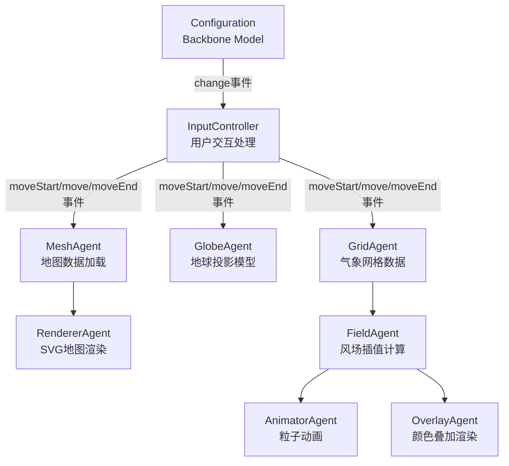

# Earth项目技术分析报告

## 目录

- [项目概述](#项目概述)
- [核心功能](#核心功能)
- [技术架构](#技术架构)
- [数据来源与格式](#数据来源与格式)
- [GRIB2气象参数详解](#grib2气象参数详解)
- [数据获取方法](#数据获取方法)
- [本地运行指南](#本地运行指南)
- [核心技术实现亮点](#核心技术实现亮点)
- [项目结构说明](#项目结构说明)
- [数据文件组织与命名规则](#数据文件组织与命名规则)
- [电磁传播影响分析](#电磁传播影响分析)
- [界面模式详解](#界面模式详解)
- [技术总结](#技术总结)

## 项目概述

Earth是一个全球天气状况可视化项目，由Cameron Beccario开发。该项目基于早期的[Tokyo Wind Map](https://github.com/cambecc/air)项目，是一个个人学习项目，用于掌握JavaScript和浏览器编程技术。

**项目特点：**

- 实时可视化全球风场和天气数据
- 支持多种地图投影和交互操作
- 基于超级计算机预报数据
- 每3小时更新一次气象数据
- 每5天更新一次海洋洋流数据

**在线演示：** http://earth.nullschool.net

## 核心功能

### 1. 风场动画可视化

- 使用粒子动画技术展示全球风向和风速
- 支持不同气压层的气象数据可视化
- 实时粒子流动效果，直观展示风场变化

### 2. 多层气象数据支持

支持8个不同气压层的数据：

- **地表层** (Surface)
- **1000 hPa** (~100m高度，近海平面条件)
- **850 hPa** (~1500m高度)
- **700 hPa** (~3000m高度)
- **500 hPa** (~5500m高度)
- **250 hPa** (~10000m高度)
- **70 hPa** (~18000m高度)
- **10 hPa** (~30000m高度)

### 3. 多种叠加图层

- **风速** (Wind Speed)
- **温度** (Temperature)
- **相对湿度** (Relative Humidity)
- **空气密度** (Air Density)
- **风能密度** (Wind Power Density)
- **可降水量** (Total Precipitable Water)
- **总云水** (Total Cloud Water)
- **海平面气压** (Mean Sea Level Pressure)

### 4. 海洋洋流数据

- 显示全球海洋表面洋流
- 基于OSCAR (Ocean Surface Current Analysis Real-time)数据
- 每5天更新一次

### 5. 多种地图投影

支持8种不同的地图投影方式：

- **正交投影** (Orthographic)
- **立体投影** (Stereographic)
- **等距圆锥投影** (Conic Equidistant)
- **等距方位投影** (Azimuthal Equidistant)
- **等距圆柱投影** (Equirectangular)
- **Winkel Tripel投影**
- **Waterman Butterfly投影**
- **Atlantis投影**

### 6. 交互功能

- **拖拽旋转**：鼠标拖拽旋转地球
- **缩放控制**：滚轮或手势缩放
- **点击查询**：点击查看具体位置的气象数据
- **时间控制**：前进/后退查看不同时间的数据
- **位置定位**：自动定位到用户当前位置

## 技术架构

### 前端技术栈

| 技术                    | 版本   | 用途                          |
| ----------------------- | ------ | ----------------------------- |
| **D3.js**         | 3.3.10 | 地图投影、SVG渲染、数据可视化 |
| **Backbone.js**   | 1.1.0  | MVC架构、状态管理、URL路由    |
| **Underscore.js** | 1.6.0  | 工具函数库                    |
| **TopoJSON**      | 1.1.0  | 地理数据格式，压缩地图数据    |
| **when.js**       | 2.6.0  | Promise库，处理异步操作       |
| **HTML5 Canvas**  | -      | 粒子动画和颜色叠加渲染        |
| **SVG**           | -      | 地图渲染                      |

### 后端技术栈

| 技术              | 版本       | 用途           |
| ----------------- | ---------- | -------------- |
| **Node.js** | >= 0.10.21 | 运行环境       |
| **Express** | 3.4.4      | 静态文件服务器 |
| **Swig**    | 1.2.2      | 模板引擎       |

### 架构设计

项目采用**事件驱动架构**，核心组件通过事件进行通信：



### 核心JavaScript模块

#### 1. micro.js - 工具函数集合

```javascript
// 核心工具函数
var µ = function() {
    "use strict";
  
    // 数学工具
    function distance(a, b) { /* 计算两点距离 */ }
    function clamp(x, low, high) { /* 数值范围限制 */ }
    function floorMod(a, n) { /* 取模运算 */ }
  
    // 颜色处理
    function extendedSinebowColor(v, a) { /* 颜色渐变 */ }
  
    // 设备检测
    function isMobile() { /* 移动设备检测 */ }
  
    return {
        distance: distance,
        clamp: clamp,
        // ... 其他工具函数
    };
}();
```

#### 2. globes.js - 地球投影模型

```javascript
var globes = function() {
    "use strict";
  
    // 标准地球模型
    function standardGlobe() {
        return {
            projection: null,
            newProjection: function(view) { /* 创建新投影 */ },
            bounds: function(view) { /* 计算投影边界 */ },
            fit: function(view) { /* 自适应缩放 */ },
            center: function(view) { /* 居中显示 */ },
            scaleExtent: function() { /* 缩放范围 */ },
            orientation: function(o, view) { /* 方向控制 */ }
        };
    }
  
    // 不同投影类型
    return {
        orthographic: function() { /* 正交投影 */ },
        stereographic: function() { /* 立体投影 */ },
        // ... 其他投影
    };
}();
```

#### 3. products.js - 气象数据产品定义

```javascript
var products = function() {
    "use strict";
  
    // 风场数据产品
    "wind": {
        matches: _.matches({param: "wind"}),
        create: function(attr) {
            return buildProduct({
                field: "vector",
                type: "wind",
                paths: [gfs1p0degPath(attr, "wind", attr.surface, attr.level)],
                date: gfsDate(attr),
                builder: function(file) {
                    var uData = file[0].data, vData = file[1].data;
                    return {
                        header: file[0].header,
                        interpolate: bilinearInterpolateVector,
                        data: function(i) { return [uData[i], vData[i]]; }
                    }
                },
                units: [
                    {label: "km/h", conversion: function(x) { return x * 3.6; }},
                    {label: "m/s", conversion: function(x) { return x; }},
                    {label: "kn", conversion: function(x) { return x * 1.943844; }},
                    {label: "mph", conversion: function(x) { return x * 2.236936; }}
                ]
            });
        }
    }
};
```

#### 4. earth.js - 主应用逻辑

```javascript
// 核心组件初始化
var configuration = µ.buildConfiguration(globes, products.overlayTypes);
var inputController = buildInputController();
var meshAgent = newAgent();
var globeAgent = newAgent();
var gridAgent = newAgent();
var rendererAgent = newAgent();
var fieldAgent = newAgent();
var animatorAgent = newAgent();
var overlayAgent = newAgent();

// 事件绑定和组件协调
configuration.on("change", function() { /* 配置变化处理 */ });
inputController.on("moveStart", function() { /* 开始移动 */ });
inputController.on("move", function() { /* 移动中 */ });
inputController.on("moveEnd", function() { /* 移动结束 */ });
```

## 数据来源与格式

### 气象数据（Weather Data）

#### 数据来源

- **系统**：GFS (Global Forecast System)
- **提供方**：美国国家气象局 NCEP (National Centers for Environmental Prediction)
- **官网**：http://www.emc.ncep.noaa.gov
- **下载地址**：http://nomads.ncep.noaa.gov

#### 数据特性

- **更新频率**：每6小时更新一次
- **分辨率**：各种分辨率（0.25° × 0.25° 网格、0.5° × 0.5° 网格、1.0° × 1.0° 网格等）
- **覆盖范围**：全球
- **原始格式**：GRIB2格式
- **使用格式**：JSON格式

#### 数据结构

```json
[{
  "header": {
    "discipline": 0,
    "disciplineName": "Meteorological products",
    "gribEdition": 2,
    "center": 7,
    "centerName": "US National Weather Service - NCEP(WMC)",
    "refTime": "2014-01-31T00:00:00.000Z",
    "significanceOfRT": 1,
    "significanceOfRTName": "Start of forecast",
    "parameterNumberName": "U-component_of_wind",
    "parameterUnit": "m.s-1",
    "forecastTime": 3,
    "surface1TypeName": "Specified height level above ground",
    "surface1Value": 10,
    "nx": 360,
    "ny": 181,
    "lo1": 0,
    "la1": 90,
    "lo2": 359,
    "la2": -90,
    "dx": 1,
    "dy": 1
  },
  "data": [-4.76, -4.75, -4.73, -4.72, -4.7, ...]
}]
```

**风速数据包含两个分量：**

- **U分量**：东西向风速（m/s）
- **V分量**：南北向风速（m/s）

### 海洋洋流数据（Ocean Currents）

#### 数据来源

- **系统**：OSCAR (Ocean Surface Current Analysis Real-time)
- **提供方**：Earth & Space Research
- **官网**：http://www.esr.org/oscar_index.html

#### 数据特性

- **更新频率**：每5天更新一次
- **分辨率**：0.33°网格
- **文件位置**：`/public/data/oscar/`

#### 目录结构

```json
["20140131-surface-currents-oscar-0.33.json"]
```

### 地图数据（Geographic Data）

#### 数据来源

- **系统**：Natural Earth
- **官网**：http://www.naturalearthdata.com
- **格式**：TopoJSON（从Shapefile转换）

#### 数据内容

- **海岸线数据**：不同精度的海岸线
- **湖泊数据**：主要湖泊和内陆水域
- **两个版本**：
  - `earth-topo.json`：桌面版（更详细）
  - `earth-topo-mobile.json`：移动版（简化）

## GRIB2气象参数详解

GRIB2（Gridded Binary Format Version 2）是世界气象组织（WMO）制定的标准气象数据格式，用于存储和传输网格化的气象数据。NOAA NOMADS系统提供的GFS数据包含以下主要气象参数：

### 大气参数

#### 温度相关参数

| 参数代码       | 全称                  | 中文名称 | 单位 | 描述                   |
| -------------- | --------------------- | -------- | ---- | ---------------------- |
| **TMP**  | Temperature           | 温度     | K    | 大气温度               |
| **TMAX** | Maximum Temperature   | 最高温度 | K    | 指定时间段内的最高温度 |
| **TMIN** | Minimum Temperature   | 最低温度 | K    | 指定时间段内的最低温度 |
| **DPT**  | Dew Point Temperature | 露点温度 | K    | 水汽饱和时的温度       |
| **POT**  | Potential Temperature | 位温     | K    | 绝热过程下的温度       |

#### 湿度相关参数

| 参数代码        | 全称                     | 中文名称   | 单位   | 描述                               |
| --------------- | ------------------------ | ---------- | ------ | ---------------------------------- |
| **RH**    | Relative Humidity        | 相对湿度   | %      | 空气中水汽含量与饱和水汽含量的比值 |
| **SPFH**  | Specific Humidity        | 比湿       | kg/kg  | 单位质量湿空气中水汽的质量         |
| **PWAT**  | Precipitable Water       | 可降水量   | kg/m² | 单位面积垂直气柱中的总水汽含量     |
| **RWMR**  | Rain Water Mixing Ratio  | 雨水混合比 | kg/kg  | 单位质量干空气中雨水的质量         |
| **CLWMR** | Cloud Water Mixing Ratio | 云水混合比 | kg/kg  | 单位质量干空气中云水的质量         |
| **SNMR**  | Snow Water Mixing Ratio  | 雪水混合比 | kg/kg  | 单位质量干空气中雪的质量           |
| **ICMR**  | Ice Water Mixing Ratio   | 冰水混合比 | kg/kg  | 单位质量干空气中冰的质量           |

### 气压和高度参数

| 参数代码        | 全称                            | 中文名称       | 单位 | 描述               |
| --------------- | ------------------------------- | -------------- | ---- | ------------------ |
| **PRES**  | Pressure                        | 气压           | Pa   | 大气压力           |
| **PRMSL** | Pressure at Mean Sea Level      | 海平面气压     | Pa   | 海平面高度处的气压 |
| **MSLET** | Mean Sea Level Pressure         | 海平面气压     | Pa   | 海平面气压         |
| **HGT**   | Geopotential Height             | 位势高度       | gpm  | 等位势面高度       |
| **HPBL**  | Planetary Boundary Layer Height | 行星边界层高度 | m    | 大气边界层顶部高度 |
| **ICAHT** | Ice Height                      | 冰高度         | m    | 海冰厚度           |

### 风场参数

| 参数代码       | 全称                 | 中文名称   | 单位    | 描述               |
| -------------- | -------------------- | ---------- | ------- | ------------------ |
| **UGRD** | U-component of Wind  | 东西向风速 | m/s     | 东西方向的风速分量 |
| **VGRD** | V-component of Wind  | 南北向风速 | m/s     | 南北方向的风速分量 |
| **GUST** | Wind Speed (Gust)    | 阵风       | m/s     | 短时间内的最大风速 |
| **HLCY** | Helicity             | 螺旋度     | m²/s² | 风场旋转强度的度量 |
| **VWSH** | Vertical Speed Shear | 垂直风切变 | s⁻¹   | 风速随高度的变化率 |

### 降水参数

| 参数代码        | 全称                          | 中文名称   | 单位     | 描述               |
| --------------- | ----------------------------- | ---------- | -------- | ------------------ |
| **APCP**  | Total Precipitation           | 累积降水量 | kg/m²   | 总降水量           |
| **ACPCP** | Convective Precipitation      | 对流降水   | kg/m²   | 对流活动产生的降水 |
| **CPRAT** | Convective Precipitation Rate | 对流降水率 | kg/m²/s | 对流降水强度       |
| **PRATE** | Precipitation Rate            | 降水率     | kg/m²/s | 降水强度           |
| **CRAIN** | Convective Rain               | 对流雨     | kg/m²   | 对流性降雨         |
| **CSNOW** | Convective Snow               | 对流雪     | kg/m²   | 对流性降雪         |
| **CFRZR** | Convective Freezing Rain      | 对流冻雨   | kg/m²   | 对流性冻雨         |
| **CICEP** | Convective Ice Pellets        | 对流冰粒   | kg/m²   | 对流性冰粒         |

### 云和能见度参数

| 参数代码        | 全称               | 中文名称 | 单位 | 描述                 |
| --------------- | ------------------ | -------- | ---- | -------------------- |
| **TCDC**  | Total Cloud Cover  | 总云量   | %    | 天空被云覆盖的百分比 |
| **LCDC**  | Low Cloud Cover    | 低云量   | %    | 低云覆盖百分比       |
| **MCDC**  | Middle Cloud Cover | 中云量   | %    | 中云覆盖百分比       |
| **HCDC**  | High Cloud Cover   | 高云量   | %    | 高云覆盖百分比       |
| **VIS**   | Visibility         | 能见度   | m    | 水平能见距离         |
| **SUNSD** | Sunshine Duration  | 日照时数 | s    | 太阳直射时间         |

### 对流和稳定性参数

| 参数代码        | 全称                                  | 中文名称     | 单位 | 描述               |
| --------------- | ------------------------------------- | ------------ | ---- | ------------------ |
| **CAPE**  | Convective Available Potential Energy | 对流有效位能 | J/kg | 大气不稳定能量     |
| **CIN**   | Convective Inhibition                 | 对流抑制能量 | J/kg | 抑制对流发展的能量 |
| **LFTX**  | Lifted Index                          | 抬升指数     | K    | 大气稳定度指标     |
| **4LFTX** | 4-Layer Lifted Index                  | 4层抬升指数  | K    | 四层大气抬升指数   |

### 辐射参数

| 参数代码        | 全称                               | 中文名称     | 单位  | 描述           |
| --------------- | ---------------------------------- | ------------ | ----- | -------------- |
| **DSWRF** | Downward Short-Wave Radiation Flux | 向下短波辐射 | W/m² | 太阳短波辐射   |
| **USWRF** | Upward Short-Wave Radiation Flux   | 向上短波辐射 | W/m² | 反射的短波辐射 |
| **DLWRF** | Downward Long-Wave Radiation Flux  | 向下长波辐射 | W/m² | 大气长波辐射   |
| **ULWRF** | Upward Long-Wave Radiation Flux    | 向上长波辐射 | W/m² | 地面长波辐射   |
| **ALBDO** | Albedo                             | 反照率       | %     | 地表反射率     |

### 热通量参数

| 参数代码        | 全称                   | 中文名称   | 单位  | 描述                   |
| --------------- | ---------------------- | ---------- | ----- | ---------------------- |
| **SHTFL** | Sensible Heat Net Flux | 感热通量   | W/m² | 地表与大气间的感热交换 |
| **LHTFL** | Latent Heat Net Flux   | 潜热通量   | W/m² | 地表与大气间的潜热交换 |
| **GFLUX** | Ground Heat Flux       | 地面热通量 | W/m² | 地表热通量             |

### 地面参数

| 参数代码        | 全称              | 中文名称   | 单位   | 描述                   |
| --------------- | ----------------- | ---------- | ------ | ---------------------- |
| **SFCR**  | Surface Roughness | 地面粗糙度 | m      | 地表粗糙度长度         |
| **LAND**  | Land Cover        | 陆地掩膜   | -      | 陆地/海洋标识          |
| **VEG**   | Vegetation        | 植被       | %      | 植被覆盖度             |
| **SOILL** | Soil Moisture     | 土壤湿度   | kg/m² | 土壤含水量             |
| **SOILW** | Soil Water        | 土壤水分   | kg/m² | 土壤水分含量           |
| **SOTYP** | Soil Type         | 土壤类型   | -      | 土壤类型分类           |
| **WILT**  | Wilting Point     | 萎蔫点     | kg/m² | 植物萎蔫的土壤水分阈值 |

### 冰和雪参数

| 参数代码         | 全称                                       | 中文名称 | 单位   | 描述           |
| ---------------- | ------------------------------------------ | -------- | ------ | -------------- |
| **ICEC**   | Ice Cover                                  | 海冰浓度 | %      | 海冰覆盖百分比 |
| **ICEG**   | Ice Thickness                              | 海冰厚度 | m      | 海冰厚度       |
| **ICETK**  | Ice Thickness                              | 海冰厚度 | m      | 海冰厚度       |
| **ICETMP** | Ice Temperature                            | 海冰温度 | K      | 海冰表面温度   |
| **SNOD**   | Snow Depth                                 | 雪深     | m      | 积雪深度       |
| **WEASD**  | Water Equivalent of Accumulated Snow Depth | 雪水当量 | kg/m² | 积雪水当量     |

### 其他重要参数

| 参数代码         | 全称                                 | 中文名称           | 单位   | 描述               |
| ---------------- | ------------------------------------ | ------------------ | ------ | ------------------ |
| **ABSV**   | Absolute Vorticity                   | 绝对涡度           | s⁻¹  | 绝对涡度           |
| **DZDT**   | Vertical Velocity                    | 垂直速度           | Pa/s   | 垂直运动速度       |
| **VVEL**   | Vertical Velocity                    | 垂直速度           | m/s    | 垂直风速           |
| **CWAT**   | Cloud Water                          | 云水               | kg/m² | 云中液态水含量     |
| **CWORK**  | Cloud Work Function                  | 云功               | J/kg   | 云功函数           |
| **FLDCP**  | Flood Potential                      | 洪水潜力           | -      | 洪水潜力指数       |
| **FRICV**  | Friction Velocity                    | 摩擦速度           | m/s    | 地表摩擦速度       |
| **GRLE**   | Graupel                              | 冰雹               | kg/m² | 冰雹含量           |
| **HINDEX** | Heat Index                           | 热指数             | K      | 体感温度指数       |
| **O3MR**   | Ozone Mixing Ratio                   | 臭氧混合比         | kg/kg  | 臭氧浓度           |
| **PEVPR**  | Potential Evaporation                | 潜在蒸发           | kg/m² | 潜在蒸发量         |
| **PLPL**   | Plant Leaf Area Index                | 植物叶面积指数     | -      | 叶面积指数         |
| **REFC**   | Radar Reflectivity                   | 雷达反射率         | dBZ    | 雷达回波强度       |
| **REFD**   | Radar Reflectivity                   | 雷达反射率         | dBZ    | 雷达回波强度       |
| **TOZNE**  | Total Ozone                          | 总臭氧             | kg/m² | 臭氧总量           |
| **TSOIL**  | Soil Temperature                     | 土壤温度           | K      | 土壤温度           |
| **UFLX**   | U-component of Momentum Flux         | 东西向动量通量     | N/m²  | 东西向动量通量     |
| **VFLX**   | V-component of Momentum Flux         | 南北向动量通量     | N/m²  | 南北向动量通量     |
| **U-GWD**  | U-component of Gravity Wave Drag     | 东西向重力波拖拽   | m/s²  | 东西向重力波拖拽   |
| **V-GWD**  | V-component of Gravity Wave Drag     | 南北向重力波拖拽   | m/s²  | 南北向重力波拖拽   |
| **USTM**   | U-component of Storm Relative Wind   | 东西向风暴相对风速 | m/s    | 风暴相对东西向风速 |
| **VSTM**   | V-component of Storm Relative Wind   | 南北向风暴相对风速 | m/s    | 风暴相对南北向风速 |
| **VRATE**  | Vertical Velocity                    | 垂直速度           | m/s    | 垂直运动速度       |
| **WATR**   | Water                                | 水                 | kg/m² | 水含量             |
| **CNWAT**  | Cloud Water                          | 云水               | kg/m² | 云中液态水         |
| **CPOFP**  | Convective Precipitation Probability | 对流降水概率       | %      | 对流降水发生概率   |

### 参数应用场景

#### 天气预报应用

- **风场分析**：UGRD、VGRD用于风场可视化
- **降水预报**：APCP、PRATE用于降水预测
- **温度预报**：TMP、TMAX、TMIN用于温度预测
- **云量分析**：TCDC、LCDC、MCDC、HCDC用于云层分析

#### 气候研究应用

- **辐射平衡**：DSWRF、USWRF、DLWRF、ULWRF用于辐射研究
- **能量平衡**：SHTFL、LHTFL、GFLUX用于能量交换研究
- **水循环**：PWAT、SOILL、SOILW用于水循环研究

#### 数值模式验证

- **模式输出**：所有参数用于数值模式结果验证
- **观测对比**：与地面观测、卫星观测数据对比
- **模式改进**：参数偏差分析用于模式改进

### 数据质量说明

1. **空间分辨率**：1° × 1° 全球网格
2. **时间分辨率**：3小时间隔
3. **预报时效**：最长384小时（16天）
4. **更新频率**：每日4次（00Z、06Z、12Z、18Z）
5. **数据格式**：GRIB2二进制格式，转换为JSON使用

这些参数为Earth项目提供了丰富的气象数据基础，支持多种天气现象的可视化分析和预报应用。

## 数据获取方法

### 1. 气象数据获取

#### 环境准备

```bash
# 安装grib2json工具
git clone https://github.com/cambecc/grib2json
cd grib2json
mvn package
```

#### 下载和转换

```bash

根据UI中支持的数据类型，在过滤器界面选择对应的参数，生成对应的URL，然后下载数据。
# 基础风场：

https://nomads.ncep.noaa.gov/cgi-bin/filter_gfs_1p00.pl?dir=%2Fgfs.20251020%2F00%2Fatmos&file=gfs.t00z.pgrb2.1p00.anl&var_UGRD=on&var_VGRD=on&all_lev=on

# 降水：
https://nomads.ncep.noaa.gov/cgi-bin/filter_gfs_1p00.pl?dir=%2Fgfs.20251020%2F00%2Fatmos&file=gfs.t00z.pgrb2.1p00.f000&var_APCP=on&var_PRATE=on&all_lev=on


# 转换为JSON格式
# 转换后的名称格式需要根据类型选择，
grib2json -d -n -o current-wind-surface-level-gfs-1.0.json gfs.t00z.pgrb2.1p00.f000
grib2json -d -n -o current-relative_humidity-gfs-1.0.json gfs.t00z.pgrb2.1p00.RH.f003
 
# 复制到项目目录
cp current-wind-surface-level-gfs-1.0.json public/data/weather/current/
```

#### 不同气压层数据

```bash
# 1000 hPa层
curl "http://nomads.ncep.noaa.gov/cgi-bin/filter_gfs.pl?file=gfs.t00z.pgrb2.1p00.f000&lev_1000_mb=on&var_UGRD=on&var_VGRD=on&dir=%2Fgfs.${YYYYMMDD}00" -o gfs_1000hPa.grib2

# 500 hPa层
curl "http://nomads.ncep.noaa.gov/cgi-bin/filter_gfs.pl?file=gfs.t00z.pgrb2.1p00.f000&lev_500_mb=on&var_UGRD=on&var_VGRD=on&dir=%2Fgfs.${YYYYMMDD}00" -o gfs_500hPa.grib2
```

### 2. 地图数据获取

#### 环境准备

```bash
# 安装GDAL
# Ubuntu/Debian
sudo apt-get install gdal-bin

# macOS
brew install gdal

# 安装topojson
npm install -g topojson
```

#### 下载和转换

```bash
# 下载Natural Earth数据
curl "http://www.nacis.org/naturalearth/50m/physical/ne_50m_coastline.zip" -o ne_50m_coastline.zip
curl "http://www.nacis.org/naturalearth/50m/physical/ne_50m_lakes.zip" -o ne_50m_lakes.zip
curl "http://www.nacis.org/naturalearth/110m/physical/ne_110m_coastline.zip" -o ne_110m_coastline.zip
curl "http://www.nacis.org/naturalearth/110m/physical/ne_110m_lakes.zip" -o ne_110m_lakes.zip

# 解压
unzip -o ne_*.zip

# 转换为GeoJSON
ogr2ogr -f GeoJSON coastline_50m.json ne_50m_coastline.shp
ogr2ogr -f GeoJSON coastline_110m.json ne_110m_coastline.shp
ogr2ogr -f GeoJSON -where "scalerank < 4" lakes_50m.json ne_50m_lakes.shp
ogr2ogr -f GeoJSON -where "scalerank < 2 AND admin='admin-0'" lakes_110m.json ne_110m_lakes.shp

# 创建简化版本（移动端）
ogr2ogr -f GeoJSON -simplify 1 coastline_tiny.json ne_110m_coastline.shp
ogr2ogr -f GeoJSON -simplify 1 -where "scalerank < 2 AND admin='admin-0'" lakes_tiny.json ne_110m_lakes.shp

# 转换为TopoJSON
topojson -o earth-topo.json coastline_50m.json coastline_110m.json lakes_50m.json lakes_110m.json
topojson -o earth-topo-mobile.json coastline_110m.json coastline_tiny.json lakes_110m.json lakes_tiny.json

# 复制到项目目录
cp earth-topo*.json public/data/
```

### 3. 字体子集化

#### M+ FONTS子集化

```bash
# 查找使用的字符
node find-chars.js

# 使用M+Web FONTS Subsetter
# 访问：http://mplus.font-face.jp/
# 上传字体文件，选择需要的字符，下载子集字体
# 保存到：public/styles/
```

#### Mono Social Icons Font子集化

```bash
# 使用Font Squirrel's WebFont Generator
# 访问：http://www.fontsquirrel.com/tools/webfont-generator
# 上传字体文件，生成子集字体
# 保存到：public/styles/
```

## 本地运行指南

### 环境要求

- **Node.js**：>= 0.10.21
- **npm**：包管理器
- **现代浏览器**：支持HTML5 Canvas和SVG

### 安装步骤

#### 1. 克隆项目

```bash
git clone https://github.com/cambecc/earth
cd earth
```

#### 2. 安装依赖

```bash
npm install
```

#### 3. 启动开发服务器

```bash
# 启动服务器（端口8080）
node dev-server.js 8080

# 或者指定其他端口
node dev-server.js 3000
```

#### 4. 访问应用

打开浏览器访问：`http://localhost:8080`

### 注意事项

#### Ubuntu/Mint/elementary OS

由于命名冲突，需要使用 `nodejs`命令：

```bash
nodejs dev-server.js 8080
```

#### 数据文件

项目已包含示例数据文件：

- `public/data/weather/current/current-wind-surface-level-gfs-1.0.json`
- `public/data/earth-topo.json`
- `public/data/earth-topo-mobile.json`

#### 服务器特性

- 纯静态文件服务器
- 支持GZIP压缩
- 缓存控制（5分钟）
- 详细访问日志

## 核心技术实现亮点

### 1. 双线性插值算法

```javascript
function bilinearInterpolateVector(x, y, g00, g10, g01, g11) {
    var rx = (1 - x);
    var ry = (1 - y);
    var a = rx * ry, b = x * ry, c = rx * y, d = x * y;
    var u = g00[0] * a + g10[0] * b + g01[0] * c + g11[0] * d;
    var v = g00[1] * a + g10[1] * b + g01[1] * c + g11[1] * d;
    return [u, v];
}
```

**优势：**

- 1°分辨率数据通过插值实现平滑过渡
- 计算效率高，适合实时渲染
- 保持数据精度

### 2. 投影变形补偿

```javascript
// 使用有限差分近似计算投影变形
function finiteDifferenceApproximation(projection, λ, φ, δ) {
    var λ0 = λ - δ, λ1 = λ + δ;
    var φ0 = φ - δ, φ1 = φ + δ;
    var p0 = projection([λ0, φ]);
    var p1 = projection([λ1, φ]);
    var p2 = projection([λ, φ0]);
    var p3 = projection([λ, φ1]);
  
    return {
        scaleX: (p1[0] - p0[0]) / (2 * δ),
        scaleY: (p3[1] - p2[1]) / (2 * δ)
    };
}
```

**解决的问题：**

- 不同投影方式的地球变形
- 确保粒子路径在投影后正确显示
- 处理极地和高纬度地区的特殊变形

### 3. Canvas蒙版技术

```javascript
// 创建离屏Canvas作为蒙版
function createGlobeMask(projection, width, height) {
    var canvas = document.createElement('canvas');
    canvas.width = width;
    canvas.height = height;
    var ctx = canvas.getContext('2d');
  
    // 绘制地球轮廓
    var path = d3.geo.path().projection(projection).context(ctx);
    ctx.fillStyle = 'white';
    ctx.fill();
    path({type: "Sphere"});
  
    return canvas;
}

// 使用蒙版判断点是否在地球内
function isPointInGlobe(x, y, maskCanvas) {
    var ctx = maskCanvas.getContext('2d');
    var imageData = ctx.getImageData(x, y, 1, 1);
    return imageData.data[3] > 0; // 检查alpha通道
}
```

**技术优势：**

- 精确判断粒子是否在地球范围内
- 支持任意复杂的地球投影
- 性能优化，避免复杂的几何计算

### 4. 粒子动画系统

```javascript
function ParticleAnimator(particles, field, bounds) {
    this.particles = particles;
    this.field = field;
    this.bounds = bounds;
  
    this.animate = function() {
        for (var i = 0; i < this.particles.length; i++) {
            var particle = this.particles[i];
          
            // 更新粒子位置
            var velocity = this.field.interpolate(particle.x, particle.y);
            particle.x += velocity[0] * this.velocityScale;
            particle.y += velocity[1] * this.velocityScale;
          
            // 检查边界
            if (!this.bounds.contains(particle.x, particle.y)) {
                this.respawn(particle);
            }
          
            // 更新年龄
            particle.age++;
            if (particle.age > this.maxAge) {
                this.respawn(particle);
            }
        }
    };
}
```

**特性：**

- 数千个粒子同时动画
- 自适应粒子密度（移动端减少）
- 平滑的粒子生命周期管理
- 基于风场数据的真实物理模拟

### 5. URL状态管理

```javascript
// 使用Backbone Model管理状态
var Configuration = Backbone.Model.extend({
    defaults: {
        orientation: [0, 0, 1],
        projection: "orthographic",
        layer: "wind",
        surface: "surface",
        level: "level"
    },
  
    initialize: function() {
        this.loadFromHash();
        this.on('change', this.saveToHash);
        window.addEventListener('hashchange', this.loadFromHash.bind(this));
    },
  
    saveToHash: function() {
        var hash = this.toJSON();
        window.location.hash = '#' + JSON.stringify(hash);
    },
  
    loadFromHash: function() {
        var hash = window.location.hash.slice(1);
        if (hash) {
            try {
                this.set(JSON.parse(hash));
            } catch (e) {
                console.warn('Invalid hash format');
            }
        }
    }
});
```

**优势：**

- 支持深度链接和书签
- 浏览器前进/后退支持
- 状态持久化
- 无需服务器端状态管理

### 6. 响应式设计

```javascript
// 移动设备检测
function isMobile() {
    return /Android|webOS|iPhone|iPad|iPod|BlackBerry|IEMobile|Opera Mini/i.test(navigator.userAgent);
}

// 自适应粒子数量
var PARTICLE_MULTIPLIER = isMobile() ? 7 * 0.75 : 7;

// 自适应地图数据
var TOPOLOGY = isMobile() ? 
    "/data/earth-topo-mobile.json?v2" : 
    "/data/earth-topo.json?v2";
```

**优化策略：**

- 移动端减少粒子数量
- 使用简化的地图数据
- 优化触摸交互
- 降低动画帧率

## 项目结构说明

```
earth/
├── public/                          # 静态资源目录
│   ├── data/                       # 数据文件目录
│   │   ├── earth-topo.json         # 桌面版地图数据
│   │   ├── earth-topo-mobile.json  # 移动版地图数据
│   │   ├── weather/                # 气象数据目录
│   │   │   └── current/            # 当前气象数据
│   │   │       └── current-wind-surface-level-gfs-1.0.json
│   │   └── oscar/                  # 海洋洋流数据
│   │       ├── catalog.json        # 数据目录
│   │       └── 20140131-surface-currents-oscar-0.33.json
│   ├── libs/                       # 第三方库目录
│   │   ├── d3/3.3.10/             # D3.js库
│   │   ├── backbone.js/1.1.0/     # Backbone.js库
│   │   ├── underscore.js/1.6.0/   # Underscore.js库
│   │   ├── topojson/1.1.0/        # TopoJSON库
│   │   ├── when/2.6.0/            # when.js库
│   │   ├── d3.geo/0.0.0/          # D3地理投影库
│   │   └── earth/1.0.0/           # 项目核心模块
│   │       ├── micro.js           # 工具函数
│   │       ├── globes.js          # 地球投影模型
│   │       ├── products.js        # 数据产品定义
│   │       └── earth.js           # 主应用逻辑
│   ├── styles/                     # 样式文件
│   │   ├── styles.css             # 主样式表
│   │   ├── mplus-2p-light-sub.ttf # M+字体子集
│   │   └── monosocialiconsfont-sub.ttf # 图标字体子集
│   ├── templates/                  # 模板文件
│   │   ├── index.html             # 主页面模板
│   │   ├── about.html             # 关于页面模板
│   │   └── il8n.json              # 国际化文件
│   ├── test/                       # 测试文件
│   │   ├── micro-test.html        # 工具函数测试
│   │   └── products-test.html     # 数据产品测试
│   ├── jp/                         # 日语版本
│   │   ├── index.html
│   │   └── about.html
│   ├── index.html                  # 主页面
│   ├── about.html                  # 关于页面
│   └── favicon.ico                 # 网站图标
├── dev-server.js                   # 开发服务器
├── package.json                    # 项目配置
├── Gruntfile.js                    # 构建配置
├── README.md                       # 项目说明
└── LICENSE.md                      # 许可证
```

### 核心文件说明

#### 1. dev-server.js

```javascript
// 简单的Express静态文件服务器
var express = require("express");
var app = express();

app.use(cacheControl());           // 缓存控制
app.use(express.compress());       // GZIP压缩
app.use(logger());                // 访问日志
app.use(express.static("public")); // 静态文件服务

app.listen(port);
```

#### 2. package.json

```json
{
    "name": "earth",
    "version": "0.0.1",
    "dependencies": {
        "when": "2.6.0",      // Promise库
        "swig": "1.2.2",      // 模板引擎
        "mkdirp": "0.3.5",    // 目录创建
        "express": "3.4.4"    // Web框架
    },
    "devDependencies": {
        "grunt": "~0.4.1",
        "grunt-contrib-jshint": "~0.7.1"
    }
}
```

#### 3. Gruntfile.js

```javascript
// 代码质量检查配置
grunt.initConfig({
    jshint: {
        files: ["*.js", "public/libs/earth/**/*.js"],
        options: {
            globals: {
                Buffer: false,
                console: false,
                // ... 其他全局变量
            }
        }
    }
});
```

## 数据文件组织与命名规则

### Weather目录结构

Earth项目采用严格的文件命名规则来组织气象数据：

#### 目录结构

```
public/data/weather/
├── current/                    # 当前数据目录（固定）
│   ├── current-wind-surface-level-gfs-1.0.json           # 地表风场（必需）
│   ├── current-wind-isobaric-1000hPa-gfs-1.0.json        # 1000hPa风场
│   ├── current-wind-isobaric-850hPa-gfs-1.0.json         # 850hPa风场
│   ├── current-wind-isobaric-700hPa-gfs-1.0.json         # 700hPa风场
│   ├── current-wind-isobaric-500hPa-gfs-1.0.json         # 500hPa风场
│   ├── current-wind-isobaric-250hPa-gfs-1.0.json         # 250hPa风场
│   ├── current-wind-isobaric-70hPa-gfs-1.0.json          # 70hPa风场
│   ├── current-wind-isobaric-10hPa-gfs-1.0.json          # 10hPa风场
│   ├── current-temp-surface-level-gfs-1.0.json           # 地表温度
│   ├── current-relative_humidity-surface-level-gfs-1.0.json # 相对湿度
│   ├── current-air_density-surface-level-gfs-1.0.json    # 空气密度
│   ├── current-total_cloud_water-gfs-1.0.json            # 总云水
│   ├── current-total_precipitable_water-gfs-1.0.json     # 可降水量
│   └── current-mean_sea_level_pressure-gfs-1.0.json      # 海平面气压
└── 20251020/                  # 历史数据目录（日期格式）
    └── 00-wind-surface-level-gfs-1.0.json
```

#### 文件命名规则

```javascript
// 命名格式：{时间戳}-{类型}-{表面}-{层级}-gfs-1.0.json
function gfs1p0degPath(attr, type, surface, level) {
    var dir = attr.date, stamp = dir === "current" ? "current" : attr.hour;
    var file = [stamp, type, surface, level, "gfs", "1.0"].filter(µ.isValue).join("-") + ".json";
    return [WEATHER_PATH, dir, file].join("/");
}
```

#### 必需文件分析

**地表风场文件是绝对必需的**，代码证据：

```javascript
// 1. 默认配置设置
d3.select("#wind-mode-enable").on("click", function() {
    configuration.save({
        param: "wind", 
        surface: "surface", 
        level: "level", 
        overlayType: "default"
    });
});

// 2. 按钮绑定机制
d3.selectAll(".surface").each(function() {
    var id = this.id, parts = id.split("-");
    bindButtonToConfiguration("#" + id, {
        param: "wind", 
        surface: parts[0], 
        level: parts[1]
    });
});

// 3. 文件路径生成
paths: [gfs1p0degPath(attr, "wind", attr.surface, attr.level)]
// 当 {surface: "surface", level: "level"} 时
// 生成：/data/weather/current/current-wind-surface-level-gfs-1.0.json
```

### 模式与数据文件关系

#### Air Mode（大气模式）

- **基础文件**：地表风场文件（必需）
- **叠加文件**：根据用户选择的叠加图层动态加载
- **层级文件**：根据用户选择的气压层动态加载
- **文件数量**：1个基础文件 + N个叠加文件

#### Ocean Mode（海洋模式）

- **基础文件**：OSCAR洋流数据
- **文件位置**：`/data/oscar/`
- **文件数量**：2个文件（catalog.json + 洋流数据文件）

### 数据加载机制

#### 按需加载策略

```javascript
function buildGrids() {
    // 根据配置属性加载所有匹配的产品
    var loaded = when.map(products.productsFor(configuration.attributes), function(product) {
        return product.load(cancel);
    });
    return when.all(loaded).then(function(products) {
        return {primaryGrid: products[0], overlayGrid: products[1] || products[0]};
    });
}
```

#### 文件依赖关系

- **风场数据**：需要U和V两个分量在同一个JSON文件中
- **标量数据**：每个气象要素独立文件
- **风能密度**：依赖风场和空气密度两个文件

## 电磁传播影响分析

### 影响电磁传播的气象数据

#### 高影响参数

- **相对湿度 (RH)**：水汽分子对电磁波的吸收和散射
- **降水率 (PRATE)**：雨滴对电磁波的散射和吸收
- **云水含量 (TCW)**：云中液态水对电磁波的散射
- **可降水量 (TPW)**：大气中水汽总量影响电磁波传播

#### 中等影响参数

- **温度 (TMP)**：影响大气折射率
- **海平面气压 (PRMSL)**：大气密度影响电磁波折射
- **风速 (UGRD, VGRD)**：影响大气湍流和折射率起伏

#### 不同频段敏感性

- **低频段 (< 1 GHz)**：主要受大气折射、多径效应影响
- **中频段 (1-10 GHz)**：主要受雨衰减、云衰减影响
- **高频段 (> 10 GHz)**：主要受雨衰减、水汽吸收影响

### 电磁传播计算示例

```javascript
// 计算电磁传播损耗
function calculatePropagationLoss(frequency, humidity, precipitation) {
    var rainAttenuation = calculateRainAttenuation(frequency, precipitation);
    var waterVaporAttenuation = calculateWaterVaporAttenuation(frequency, humidity);
    var cloudAttenuation = calculateCloudAttenuation(frequency, cloudWater);
  
    return rainAttenuation + waterVaporAttenuation + cloudAttenuation;
}

// 雨衰减计算（ITU-R P.838-3模型）
function calculateRainAttenuation(frequency, rainRate) {
    var a = 0.0001 * Math.pow(frequency, 2.5);
    var b = 0.0001 * Math.pow(frequency, 1.5);
    return a * Math.pow(rainRate, b);
}
```

## 界面模式详解

### Air Mode（大气模式）

- **默认模式**：项目启动时默认显示
- **核心功能**：风场粒子动画 + 气象要素叠加
- **支持层级**：8个气压层（地表到10hPa）
- **叠加选项**：None, Wind, Temp, RH, AD, WPD, TPW, TCW, MSLP

### Ocean Mode（海洋模式）

- **切换方式**：点击"Ocean"按钮
- **核心功能**：海洋洋流数据可视化
- **数据源**：OSCAR (Ocean Surface Current Analysis Real-time)
- **叠加选项**：None, Currents

### 界面按钮含义

| 按钮           | 全称                     | 功能               | 对应类型                     | 关键参数                                |
| -------------- | ------------------------ | ------------------ | ---------------------------- | --------------------------------------- |
| **None** | None                     | 关闭所有叠加图层   | `off`                      | -                                       |
| **Wind** | Wind Speed               | 风速叠加图层       | `wind`                     | `var_UGRD=on&var_VGRD=on`             |
| **Temp** | Temperature              | 温度叠加图层       | `temp`                     | `var_TMP=on`                          |
| **RH**   | Relative Humidity        | 相对湿度叠加图层   | `relative_humidity`        | `var_RH=on`                           |
| **AD**   | Air Density              | 空气密度叠加图层   | `air_density`              | `var_PRES=on&var_TMP=on`              |
| **WPD**  | Wind Power Density       | 风能密度叠加图层   | `wind_power_density`       | `var_UGRD=on&var_VGRD=on&var_PRES=on` |
| **TPW**  | Total Precipitable Water | 可降水量叠加图层   | `total_precipitable_water` | `var_PWAT=on`                         |
| **TCW**  | Total Cloud Water        | 总云水叠加图层     | `total_cloud_water`        | `var_CWAT=on`                         |
| **MSLP** | Mean Sea Level Pressure  | 海平面气压叠加图层 | `mean_sea_level_pressure`  | `var_PRMSL=on`                        |

**关键参数说明：**

- **关键参数列**：显示从NCEP下载数据时需要在URL中指定的参数
- **使用方法**：在NCEP GRIB Filter URL中添加这些参数，例如：
  ```bash
  # 下载风速数据
  curl "http://nomads.ncep.noaa.gov/cgi-bin/filter_gfs.pl?file=gfs.t00z.pgrb2.1p00.f000&lev_10_m_above_ground=on&var_UGRD=on&var_VGRD=on&dir=%2Fgfs.2024102000" -o wind.grib2

  # 下载可降水量数据
  curl "http://nomads.ncep.noaa.gov/cgi-bin/filter_gfs.pl?file=gfs.t00z.pgrb2.1p00.f000&lev_entire_atmosphere_single_layer=on&var_PWAT=on&dir=%2Fgfs.2024102000" -o tpw.grib2
  ```
- **复合参数**：某些图层需要多个参数组合计算（如空气密度需要气压和温度）
